# DOCKER CMD

docker build    #Used to build a Docker image from a Dockerfile.
docker run			#Used to run a Docker container based on a Docker image.
docker pull			#Used to pull a Docker image from a registry, such as Docker Hub.
docker push			#Used to push a Docker image to a registry.
docker ps			  #Used to list the running Docker containers on a system.
docker stop			#Used to stop a running Docker container.
docker rm			  #Used to remove a Docker container.
docker rmi			#Used to remove a Docker image.
docker exec			#Used to execute a command in a running Docker container.
docker logs			#Used to view the logs for a Docker container.

docker build chemin/nginx/
docker build .			#In nginx repo
docker build -t nginx .		#In nginx repo

docker run nginx
docker run -it nginx 		#Run with open terminal 
	ls 
	exit
docker run -p 8080:443 nginx

docker image ls 		#Current images
docker rmi nginx 		#Destruction of the image(id/name)
docker rmi -f

docker ps 			#Current container working
docker ps -a 			#Current container stop
docker stop "id ou name"
docker kill "id ou name" 	#When is not responding
docker container prune		#delete all container
docker system prune 		#delete all (container/image/cache ...)

docker exec -it nginx bash 	#execution of bash in the container 

docker logs "container"		#check if its working good

# DOCKER-COMPOSE CMD

up				#Create and start containers
down				#Stop and remove containers, networks, images, and volumes
start				#Start existing containers
stop				#Stop running containers
restart				#Restart running containers
build				#Build images
ps				#List containers
logs				#View output from containers
exec				#Run a command in a running container
pull				#Pull images from a registry
push				#Push images to a registry

docker-compose -f <path docker_compose> -d -build
docker-compose -f <path docker_compose> stop
docker-compose -f <path docker_compose> down -v

# Finding the right version
apt show php
apt list -a php*

# mysql cmd

mariadb -u root -p #Start

SELECT DATABASE();
SELECT User, Host FROM mysql.user;
CREATE USER 'new_user'@'localhost' IDENTIFIED BY 'pwd';
GRANT ALL PRIVILEGES ON *.* TO 'new_user'@'localhost';
CREATE DATABASE database_name;
USE database_name;
SHOW DATABASES;
SELECT * FROM table_name;
DELETE FROM table_name WHERE condition;
DROP DATABASE database_name;
DROP TABLE table_name;

# Cmd for port
cat /etc/services | grep 9000
ss -tulwn | grep LISTEN
ps aux | grep 9000
apt install net-tools 
netstat -tlpn

# Inception - SUBJECT

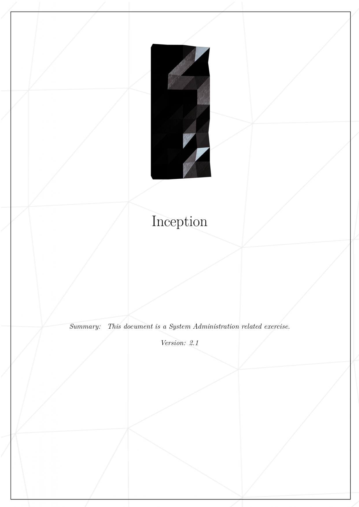
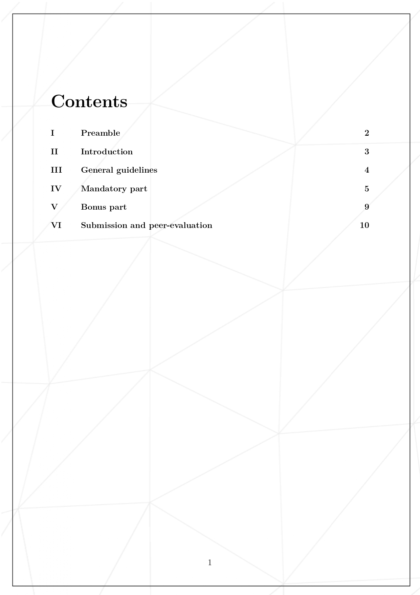
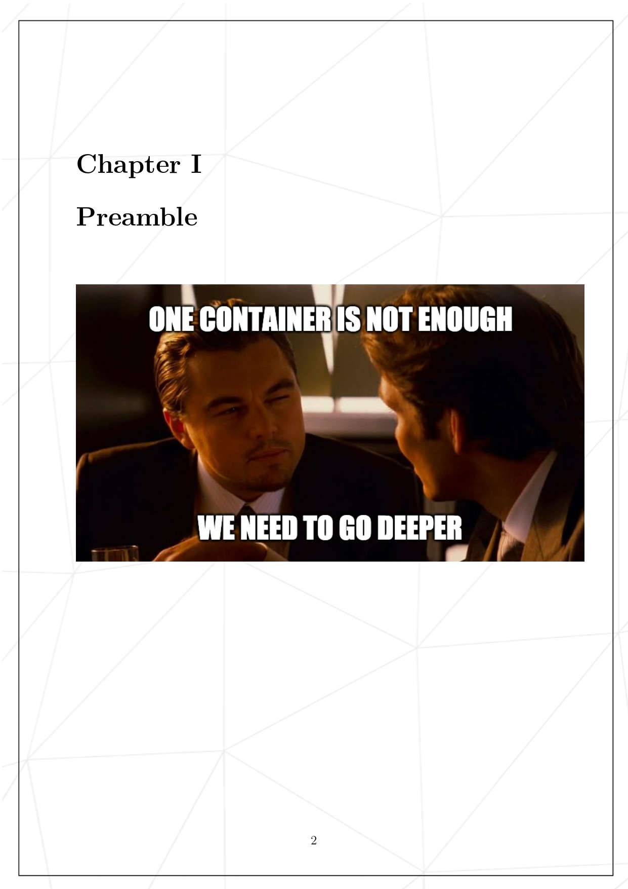
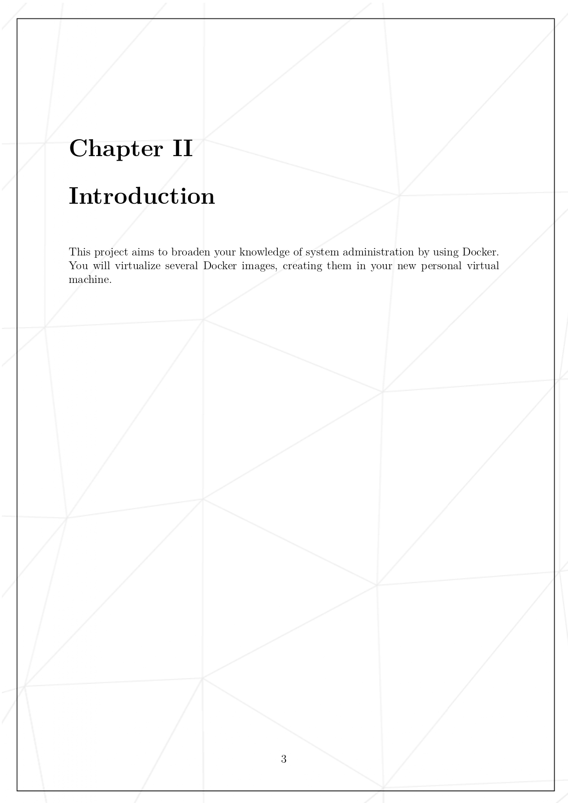
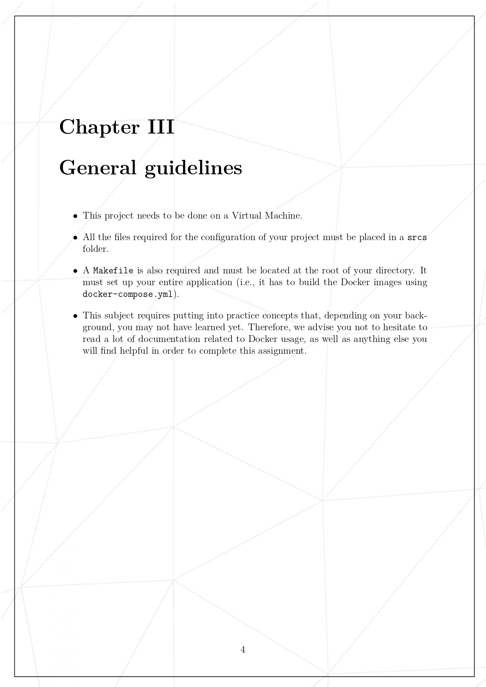
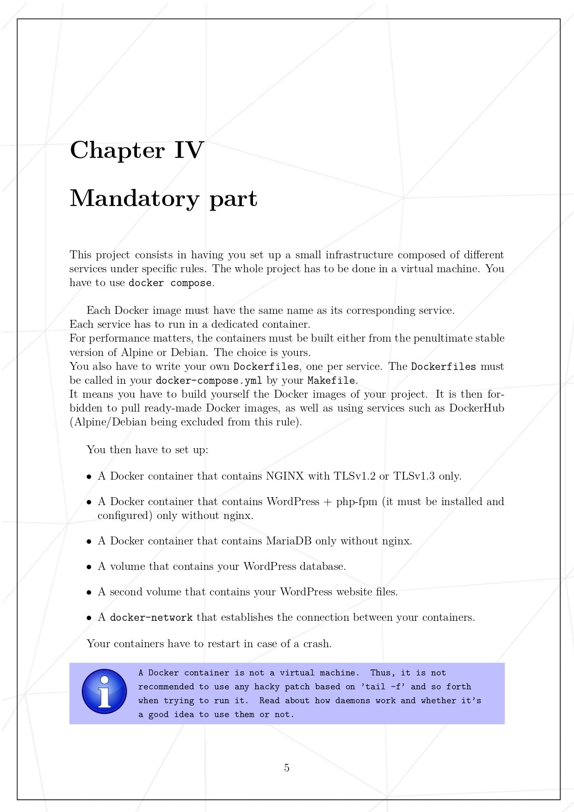
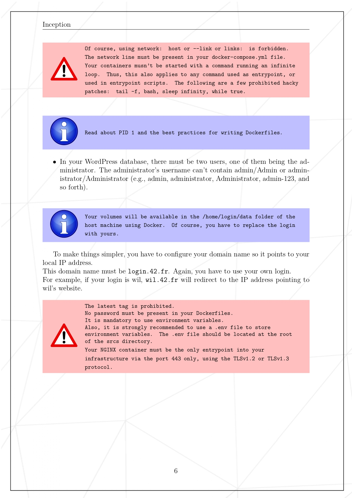
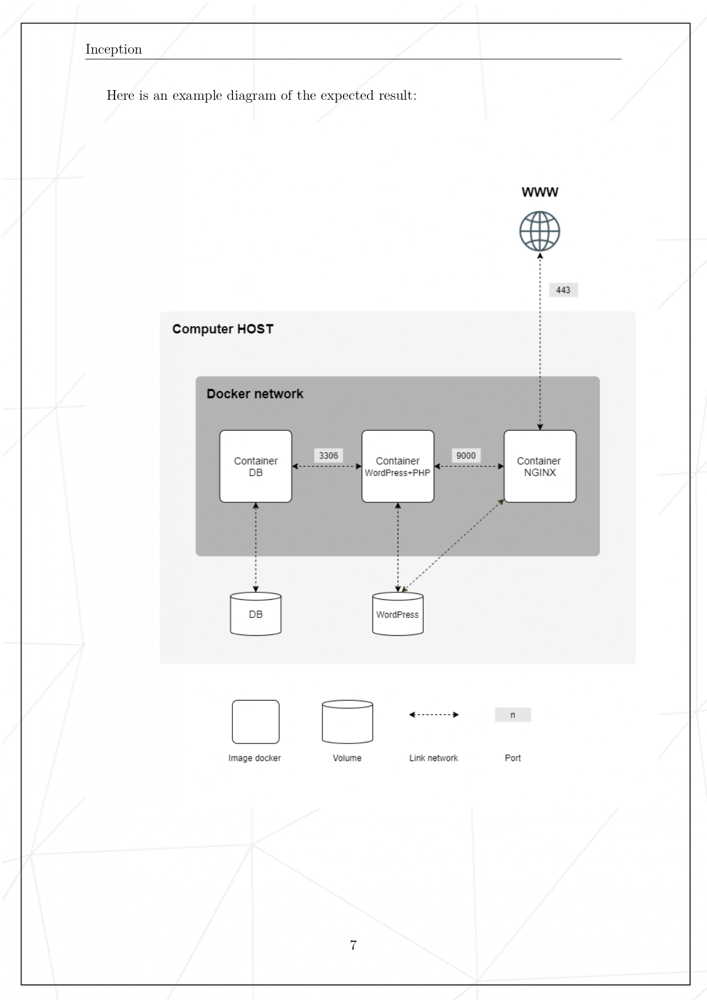
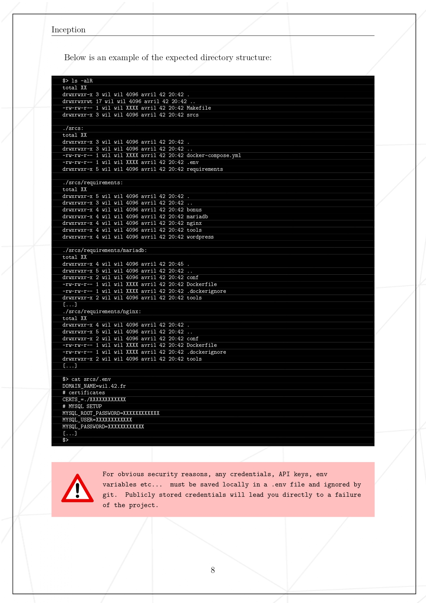
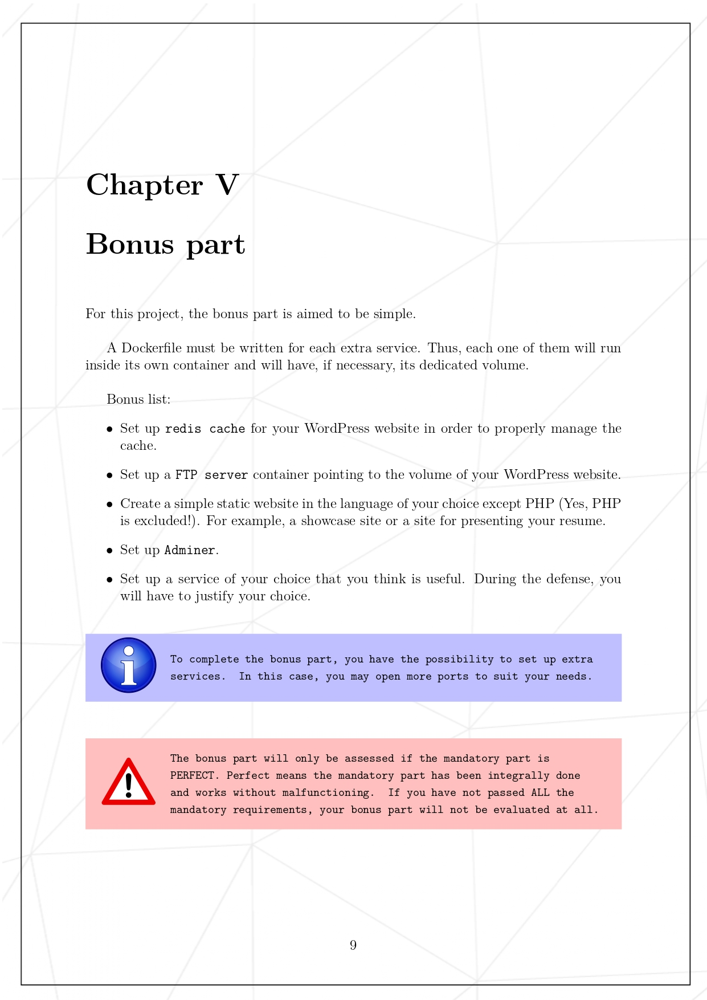
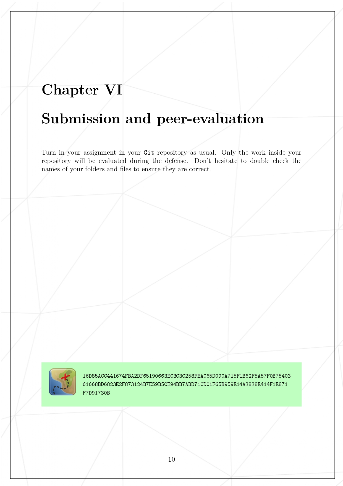

